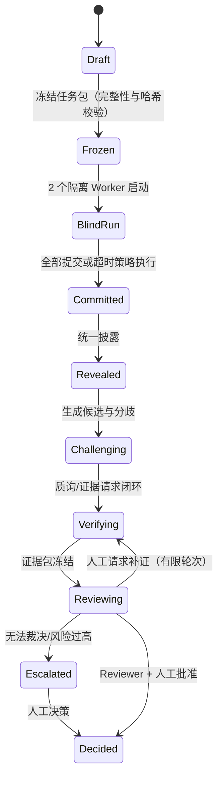

# Counterpoint（复调）

> Independent minds. Shared evidence. / 独立判断，共享证据。

按 [PRD v0.1](docs/prd/Counterpoint_复调_PRD_v0.1.md) 实现的 Evidence-Centered Multi-Agent Deliberation Workspace。本仓库当前完成 **M0 Protocol Kernel**，并覆盖 **M1/M2 的大部分核心可测试能力**与 **M3 评估框架的脚手架**。

## 已实现的能力（对应 PRD 条目）

| 领域 | 实现 | 对应需求 |
|---|---|---|
| 协议内核 | 确定性状态机 + 转换门禁 + 轮次限制 + 超时/取消/重试 | FR-002/003, 6.2/6.3, ADR-002 |
| 上下文边界 | 按阶段生成 Context View 快照；Blind/Reveal 策略；对象级可见性；审计泄漏检查 | FR-020/021/022/023, PR-01/02 |
| 产物总线 | Artifact 内容寻址、不可变版本、引用不漂移、文本 Diff、依赖链 | FR-030/031/032/033, ADR-004 |
| Commit–Reveal | 内容哈希承诺、全部提交后统一披露、事件中只存哈希不存正文 | FR-041, PR-02/03 |
| Agent 运行 | Agent Adapter 接口、Mock Adapter、本地进程 Adapter、**CLI Agent Adapter（Codex/Claude CLI JSON/JSONL 解析）**、**ACP Adapter（Agent Client Protocol v1，NDJSON/JSON-RPC）**、隔离工作区、Fingerprint | FR-010/011/013, ADR-006 |
| 证据 | Command Verifier（命令 allowlist + 超时 + stdout 哈希）、人工证据、Evidence 状态机、证据请求 | FR-044/050/051/052 |
| 质询 | 定向 Challenge / Response / Evidence Request，默认 1 轮质询 | FR-042/043, 6.4 |
| 裁决 | 匿名随机候选、Rubric Review、insufficient_evidence、Human Gate（批准/否决/合并/补证/无法裁决/升级） | FR-060/061/062/063, PR-05/06 |
| 可观测与导出 | Append-only 事件链（哈希校验）、Timeline、Decision Pack（Markdown/JSON）与全引用可追溯校验 | FR-070/072/073 |
| 评估 | A/B/C 对照 Runner、指标报表（Critical Issue Recall、Evidence Coverage、Context Leak Count、Unique Valid Claims） | FR-074, 14.3 |

## 快速开始

环境要求：Node.js ≥ 22.18（本仓库在 Node 24 上验证）。

```bash
npm install
npm run typecheck   # 全量类型检查
npm test            # 57 项测试：单元 + 泄漏证明 + 15 个端到端固定场景 + 恢复 + 评估
npm run demo        # 端到端演示（两个 Mock Worker），导出 data/out/decision-pack.md/json
npm run demo -- --local # 或: node apps/cli/main.ts demo --local（Worker A 走本地进程 Adapter）
npm run eval        # A/B/C 对照实验脚手架，报告输出到 evals/reports/
npm run slice:real  # 真实 Agent M1 切片（Chrys + Claude Code + 独立 Reviewer），产物见 docs/m1-real-slice/
npm run dev         # 启动 Web Console（API 8787 + Vite 5173，热更新）
npm run start       # 构建前端并由 API 服务在 8787 端口统一托管
```

真实 Coding Agent 连通性探测（需要本机已安装并配置好对应 CLI）：

```bash
# ACP 方式（例如 Claude Code 的 ACP 模式；以你本机 CLI 的实际参数为准）
node apps/cli/main.ts probe acp claude --acp

# CLI 方式（例如 Codex CLI 的 exec --json 模式；以你本机 CLI 的实际参数为准）
node apps/cli/main.ts probe cli codex exec --json --full-auto "{promptFile}"
```

`probe` 会在临时隔离工作区中生成一个任务包，调用真实 Agent，并把返回的 Position/Artifact/Fingerprint 打印出来。两个 Adapter 都只依赖“一个结构化 JSON 提交”契约：

- [cli-agent.ts](src/adapters/cli-agent.ts)：把任务写成 prompt 文件（支持 `{workspace}` `{promptFile}` 占位符），解析 stdout 中的 JSON / Codex JSONL / Claude JSONL，或读取 Agent 写入工作区的 `agent-output.json`。
- [acp-agent.ts](src/adapters/acp-agent.ts) + [acp-client.ts](src/adapters/acp-client.ts)：实现 ACP v1 的 `initialize → session/new → session/prompt` 生命周期，收集 `session/update` 通知（文本、工具调用、usage/成本），支持 `session/cancel`。

CLI：

```bash
node apps/cli/main.ts status <dbPath>
node apps/cli/main.ts timeline <dbPath> <deliberationId>
node apps/cli/main.ts export <dbPath> <deliberationId> [outDir]
node apps/cli/main.ts probe acp|cli <command> [args...]
```

## Web Console

Web Console 按 PRD 10.1 的工作空间模型实现：Workspace（常驻工作空间）→ WorkItem
（问题/需求/Bug/假设/技术决策）→ Research Round（可选深度研究）。默认使用 Mock
Worker/Reviewer 跑通完整协议闭环，可在 Round 创建时把 Worker 切换为本地进程适配器。

```bash
npm run dev      # 开发模式：Node API（http://localhost:8787）+ Vite（http://localhost:5173）
npm run start    # 生产模式：构建前端并由 API 服务统一托管 http://localhost:8787
```

数据默认写入 `data/store.json`（可用 `COUNTERPOINT_DB` 覆盖），Agent 工作区位于
`data/workspaces/`。界面遵循 PRD 10.2：盲态阶段只显示运行状态与承诺哈希，不展示候选
正文；披露后以“候选 X/候选 Y”匿名展示；证据状态以图标 + 文字标注；未解决分歧在
Decision 视图显式列出。运行状态通过 SSE（`/api/stream`）实时推送，断开时前端自动
轮询兜底。旧地址 `/projects/...`、`/deliberations/:id` 会自动重定向到新模型路由。

## 架构

```text
counterpoint/
├── src/
│   ├── schemas.ts             # Zod 数据契约（Task/Position/Artifact/Evidence/Review/Decision/Event）
│   ├── protocol-engine.ts     # 状态机、门禁、Commit–Reveal、Human Gate、运行调度
│   ├── state-machine.ts       # 合法转换表 + 确定性门禁
│   ├── context-policy.ts      # Context View、Blind/Reveal、Reviewer 匿名化
│   ├── artifact-registry.ts   # 版本化产物总线 + Diff
│   ├── verifier.ts            # Command Verifier + Evidence Ledger
│   ├── decision-pack.ts       # 可追溯导出（Markdown/JSON）
│   ├── store.ts               # InMemory / JsonFile 本地优先持久化
│   └── adapters/              # Agent/Reviewer Adapter 接口、Mock、本地进程
│       ├── cli-agent.ts       # CLI Agent Adapter（codex/claude 输出解析）
│       ├── acp-agent.ts       # ACP Adapter（接入 ACP 兼容 Coding Agent）
│       ├── acp-client.ts      # ACP v1 JSON-RPC/NDJSON 客户端
│       ├── prompt.ts          # 任务包 -> Agent Prompt（输出契约）
│       └── output.ts          # Agent 输出 JSON 提取与校验
├── apps/
│   ├── cli/main.ts            # CLI 入口
│   ├── cli/demo.ts            # 端到端演示
│   ├── api/                   # Web Console API（REST + SSE + 后台任务）
│   ├── web/                   # Web Console（React + Vite SPA）
│   └── worker-sample.mjs      # 本地进程 Worker 示例
├── evals/
│   ├── fixtures/              # 固定历史任务（可扩展）
│   ├── eval-core.ts           # A/B/C Runner 与指标
│   └── eval-run.ts
├── tests/
│   ├── unit/                  # 哈希/契约/状态机/策略/产物/证据
│   └── integration/           # 15 个端到端场景、泄漏证明、恢复、Decision Pack、Eval
└── docs/prd/                  # 设计文档归档
```

协议状态机：



## 验证证据

- `npm run typecheck`：全量严格类型检查通过。
- `npm test`：**57/57 通过**，包含：
  - 状态机合法转换与门禁单元测试；
  - **Context Leak 证明**：Context View、API 可见对象、物理工作区、事件载荷四个层面在 Blind 阶段均无候选泄漏（Context Leak Count = 0）；
  - 15 个端到端固定场景：正常闭环、统一披露、超时→重试、取消、失败→重试、Reviewer 证据不足→升级、人工否决/合并、Challenge/Response、证据请求闭环、验证失败→条件决策、无法裁决、产物版本不覆盖、证据轮次上限、补证循环；
  - JSON 持久化恢复与事件链哈希校验；
  - Decision Pack 全引用可追溯（unresolvedRefs = 0）与 Markdown/JSON 导出；
  - A/B/C 评估脚手架输出报表。

## 当前边界（与 PRD 的差距）

- **Web Console 已实现（v1）**：覆盖 PRD 10.1 四个页面与 10.2 展示原则；默认 Mock 适配器，可切换本地进程/CLI/ACP 适配器。
- **持久化**为单文件 JSON（Local-first 的简化形态）；生产化可换 Postgres + 文件/Git 存储（PRD 11.2）。
- **评估**目前是脚本化 Mock Agent 的方向性脚手架，不是 PRD 14.3 要求的 15–30 个真实历史任务的统计结论。
- CLI Agent 与 ACP Adapter 已实现并通过假服务器/假 CLI 测试；接入真实 Codex/Claude Code 仍需本机认证与各 CLI 实际参数确认。

## 里程碑路线（按 PRD 第 16 节）

- ✅ **M0 Protocol Kernel**（当前已完成）：状态机、Context Policy、Commit–Reveal、Artifact Registry、Mock/CLI/ACP Adapter、泄漏证明、CLI/最小 API 演示、评估脚手架。
- ▶ **M0 Planning Contract**：Plan/Validator/Compiler 契约 + 真实 Chrys/Claude Planner 探测（`npm run probe:planner`）。
- ✅ **M1 Vertical Slice**：Web 创建任务、两个隔离 Worker、Commit–Reveal、Artifact Registry、Timeline 已界面化（默认 Mock，可接本地进程/CLI/ACP）；并已用真实 Agent（Chrys + Claude Code + 独立 Reviewer）跑通第一份真实 Decision Pack，见 [docs/m1-real-slice/](docs/m1-real-slice/)。
- ▶ **M2 Evidence & Review（下一个）**：把“多个答案”升级为“证据化裁决”——引擎能力已具备，补齐真实模型 Reviewer 与更完整的界面化验证/评审体验。
- ⬜ **M3 Evaluation**：15–30 个真实历史任务的 A/B/C 对照实验与指标报表。

## 运行示例

```bash
npm run demo
```

演示会完整执行：创建项目 → 冻结任务包 → 两个隔离 Worker 盲态提交 → 统一披露 → 质询与回复 → 命令验证器生成 Evidence → 匿名 Reviewer 打分 → 人工批准 → 导出 Decision Pack 到 `data/out/`。
