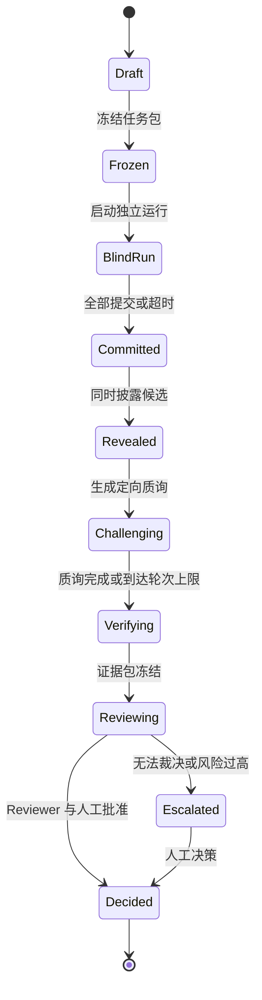
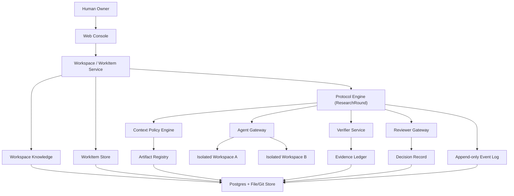

# Counterpoint（复调）PRD v0.1

> **Independent minds. Shared evidence.**  
> **独立判断，共享证据。**

| 文档属性 | 内容 |
|---|---|
| 产品工作名 | Counterpoint（复调） |
| 文档版本 | v0.1 |
| 文档状态 | Draft / 立项讨论稿 |
| 日期 | 2026-08-12 |
| 发起人 | 陈柯昊 |
| 产品类型 | Evidence-Centered Multi-Agent Deliberation Workspace |
| 第一阶段形态 | 单用户、本地优先、面向工程决策的 Web 工作台 |

> **修订说明（2026-08-12）**：引入 **Workspace / WorkItem / ResearchRound** 三层领域模型
> （见 [体验重构设计 v0.2](../superpowers/specs/2026-08-12-workspace-first-design.md)），
> 并据此重写第 8、10、11 节。第 9 节协议级功能需求保持不变，其执行单元为 ResearchRound；
> 工作项级需求将在 PRD v0.2 中正式展开。

---

## 0. 决策摘要

Counterpoint 不是一个“让很多 Agent 一起聊天”的平台，而是一套以**信息边界、独立判断、共享产物和外部证据**为核心的多 Agent 协作系统。

第一版聚焦一个窄而真实的场景：

> 用户提交一个复杂技术问题及相关代码、文档与约束；两个 Worker Agent 在隔离上下文中独立形成方案，承诺后再互相质询；系统收集工具验证结果；独立 Reviewer 按预定义 Rubric 匿名裁决；用户最终确认并导出一份可追溯的 Decision Pack。

MVP 默认采用 **2 个 Worker + 1 个独立 Reviewer + 1 个人类批准点**，而不是一开始堆叠五到十个拟人化角色。

最核心的产品原则是：

> **共享事实与已发布产物，隔离草稿与初始判断；先隔离，再承诺；先验证，再共识。**

---

## 1. 背景与问题

### 1.1 已观察到的问题

现有多 Agent 产品通常落在两种模式中：

1. **流程型多 Agent**：通过 Leader 将任务依次转发给多个角色。角色名称不同，但协同依然是中心化串行编排。
2. **群聊型多 Agent**：所有 Agent 共享同一段对话历史，通过自由讨论或多数投票生成一个共同答案。

两种模式各有价值，但都没有系统解决以下问题。

#### P1：Agent 数量不等于独立信息增量

当多个 Agent 使用相同模型、相似提示词、相同工具，并在形成判断前读取彼此结论时，它们的错误高度相关。三个相同答案可能只是同一个错误被复述三次。

#### P2：共享工作空间与隔离工作空间被错误地二选一

- 完全分离：中间产物无法自然复用，Agent 只能依赖 Leader 转述。
- 完全共享：草稿、假设和错误判断过早进入公共上下文，引发锚定、从众和上下文污染。

真正需要的是**对象级、阶段级的可见性控制**，而不是简单选择“共享”或“隔离”。

#### P3：协作围绕聊天记录，而不是围绕可版本化产物

长对话难以被引用、比较、回滚和验证。Agent 经常知道“别人说过什么”，却不知道：

- 对方具体提交了哪个版本；
- 哪条主张引用了什么证据；
- 哪个文件由谁修改；
- 哪项结论已被验证；
- 最终决策为什么发生。

#### P4：多数投票被误用为事实裁决

投票可以聚合偏好，但不能证明代码正确、接口兼容或事实成立。如果投票者之间不独立，票数还会制造虚假的确定感。

#### P5：Reviewer 并不天然独立

如果 Reviewer 继承生成者的完整叙事、作者身份、模型信息或候选顺序，它可能出现锚定、位置偏差、风格偏好和自我偏好。

#### P6：流程闭环不等于证据闭环

“需求、设计、开发、评审都走完了”只能证明流程运行过。它不能证明结果满足真实需求。完成状态必须尽量由测试、编译、静态检查、运行探针、权威资料或人工验收等外部证据决定。

### 1.2 从既有项目中保留什么

| 来源经验 | 保留 | 不直接继承 |
|---|---|---|
| Multica 类项目 | 工作项、状态机、人工门禁、Agent/Skill 追踪、工程产物沉淀 | Leader 串行转述、角色固定化、工作区分离导致的产物断裂 |
| 云端 Agent 工作台类项目 | 项目库区、任务可视化、统一工作台、低门槛使用体验 | 把漂亮工作台等同于可靠协同、无边界地共享上下文 |
| 多 Agent Debate/Vote | 多路径探索、交叉质询、方案比较 | 自由群聊、先看别人答案再思考、简单多数票定真伪 |
| 工程 Harness | 确定性状态机、权限、工具、验证器、审计日志 | 过度编排所有推理步骤、把模型当前缺陷永久固化为流程 |

---

## 2. 产品定义

### 2.1 一句话定义

Counterpoint 是一个**以证据为中心、可控制上下文边界的多 Agent 协作与裁决工作台**。

### 2.2 产品定位

Counterpoint 位于 Agent Runner、工程工具和人类决策者之间，提供：

- 独立 Agent 的任务运行环境；
- 可声明的上下文可见性策略；
- 版本化的共享产物总线；
- Commit–Reveal 协作协议；
- 结构化质询、证据与投票；
- 独立 Reviewer 和人工批准；
- 从原始任务到最终决策的可追溯链路。

Counterpoint 不替代 Codex、Claude Code 或其他 Agent。它负责定义这些 Agent **何时独立、何时共享、如何交付、如何质询、如何验证，以及由谁裁决**。

### 2.3 品牌含义

Counterpoint 在音乐中指“对位”：多个旋律声部保持自身完整性，同时遵循共同的结构和节奏形成整体。

这与产品目标对应：

- Agent 是独立声部；
- Task Packet 是共同乐谱；
- Context Policy 是可进入的段落规则；
- Artifact 与 Evidence 是可听见、可检查的演奏结果；
- Reviewer 与 Human Gate 决定最终版本，而不是强迫所有声部说同一句话。

`Counterpoint` 为工作名；正式公开发布前需完成商标、域名和软件包命名核查。

---

## 3. 产品原则

### PR-01：共享现实，隔离认知起点

原始需求、权威资料、约束和已验证证据可以共享；Agent 的草稿、初始判断和未提交假设默认私有。

### PR-02：先承诺，再披露

Agent 必须在读取其他候选答案前提交自己的 Position。系统记录内容哈希和提交时间，防止披露后无痕改写立场。

### PR-03：以产物协作，而不是以转述协作

Agent 通过发布带版本号的 Artifact、Claim、Evidence 和 Challenge 协同。Leader 或 Orchestrator 不负责替 Agent 总结完整产物。

### PR-04：证据高于共识

测试、编译、运行结果、权威来源和可复现实验优先于投票。多数意见只是一条信号，不是事实证明。

### PR-05：Reviewer 与生成过程解耦

Reviewer 默认只看到冻结后的候选、Rubric、证据和必要上下文；候选作者、模型提供方和显示顺序在裁决前隐藏或随机化。

### PR-06：保留分歧，不强制一致

系统允许输出“无法裁决”“条件性选择”或“需要补证”。停止并请求人工不是失败，而是一种合法结果。

### PR-07：确定性骨架，Agentic 关节

状态转换、权限、可见性、哈希、门禁和审计由确定性代码控制；任务分析、方案生成、质询与综合由 Agent 完成。

### PR-08：不存储隐藏思维链

系统只要求 Agent 提交结构化结论、简明理由、证据、未知项和置信度，不要求或持久化模型的隐藏 Chain-of-Thought。

### PR-09：复杂度必须证明价值

每增加一个 Agent、讨论轮次或门禁，都必须说明它降低了哪类错误，并用实验验证收益是否高于成本。

---

## 4. 产品目标与非目标

### 4.1 MVP 目标

| 编号 | 目标 |
|---|---|
| G-01 | 让两个 Agent 基于同一冻结任务包，在彼此不可见的条件下独立提交方案 |
| G-02 | 让 Agent 发布的文件、方案和证据进入同一版本化共享空间，并可被精确引用 |
| G-03 | 支持承诺后披露、定向质询、补证和有限轮次讨论 |
| G-04 | 接入至少一种确定性验证器，并将结果绑定到具体主张或产物版本 |
| G-05 | 由独立 Reviewer 按固定 Rubric 匿名评审，并保留裁决理由 |
| G-06 | 支持人工批准、否决、要求补证或升级 |
| G-07 | 导出包含任务、候选、证据、分歧、评分和决策的 Decision Pack |
| G-08 | 能与单 Agent、自审式 Agent 和全共享上下文多 Agent 做可重复对照实验 |

### 4.2 MVP 非目标

| 编号 | 非目标 |
|---|---|
| NG-01 | 不构建通用“数字员工市场”或角色市场 |
| NG-02 | 不追求无人值守完成任意长任务 |
| NG-03 | 不支持开放式无限 Agent 社交网络 |
| NG-04 | 不把自由群聊作为核心交互 |
| NG-05 | 不自动把未经验证的讨论内容写入长期记忆 |
| NG-06 | 不在首版实现多租户、企业级组织权限与计费 |
| NG-07 | 不在首版实现复杂的自动分支合并和多 Agent 同时改代码 |
| NG-08 | 不以 Agent 数量、讨论轮数或运行时长作为成功指标 |

---

## 5. 目标用户与首个场景

### 5.1 第一目标用户

需要对复杂技术问题做出可解释决策的工程师、架构师和技术负责人，尤其适用于：

- 问题存在多个可行方案；
- 单一 Agent 容易遗漏约束；
- 结论需要复核、留痕或向团队解释；
- 可以获得部分代码、文档、测试或权威资料作为外部证据。

### 5.2 首个 MVP 模板：Technical Decision Review

用户输入：

- 技术问题；
- 目标与非目标；
- 约束；
- 相关代码仓、文档或文件；
- 决策 Rubric；
- 允许使用的工具；
- 期望交付形式。

系统输出：

- 两份独立候选方案；
- 候选间的关键分歧矩阵；
- 结构化质询及回复；
- 已验证与未验证证据；
- 匿名 Reviewer 评分；
- 最终建议、保留意见和人工决策；
- 可导出的 ADR/Decision Pack。

### 5.3 适合 MVP 的示例任务

- 现有模块应采用同步调用还是事件驱动；
- 某接口兼容性改造应选择哪种迁移方案；
- 一个跨模块需求可能影响哪些边界和状态机；
- 某个技术设计是否遗漏异常、幂等和回滚路径；
- 两个实现方案中哪个更符合既有代码与验收条件。

---

## 6. 核心协作协议

### 6.1 默认拓扑

| 参与者 | 默认数量 | 职责 |
|---|---:|---|
| Human Owner | 1 | 定义任务、Rubric 和权限；最终批准或升级 |
| Worker | 2 | 盲态独立分析、提交候选、互相质询与补证 |
| Reviewer | 1 | 不参与候选生成；按 Rubric 匿名评审并裁决 |
| Verifier | 0..N | 运行确定性工具或调用权威来源，生成 Evidence |
| Protocol Engine | 1 | 执行状态机、可见性、轮次、门禁和超时 |

### 6.2 状态机



### 6.3 状态转换门禁

| 当前状态 | 进入下一状态的必要条件 |
|---|---|
| Draft → Frozen | Task Packet、Rubric、参与者与权限已确认；生成不可变版本和哈希 |
| Frozen → BlindRun | 每个 Worker 获得独立 Context View 和独立运行空间 |
| BlindRun → Committed | Worker 提交 Position、Artifact 清单、Claim、Unknown 和内容哈希 |
| Committed → Revealed | 所有正常 Worker 已提交，或超时策略已执行；统一披露而非顺序披露 |
| Revealed → Challenging | 候选匿名化并随机排序；生成差异矩阵 |
| Challenging → Verifying | 每个关键 Challenge 已回复、转为 Evidence Request 或标记无法回答 |
| Verifying → Reviewing | Verifier 运行结束；Evidence 状态已固定为 verified/failed/inconclusive |
| Reviewing → Decided | Reviewer 完成 Rubric；Human Owner 批准或明确授权自动决策 |

### 6.4 讨论规则

MVP 不支持无限自由讨论。每条讨论必须是以下结构化对象之一：

- `Claim`：可被支持或反驳的主张；
- `Challenge`：指向某条 Claim、Artifact 或 Evidence 的质询；
- `EvidenceRequest`：要求提供某种可验证材料；
- `Response`：对 Challenge 的回应；
- `Concession`：明确撤回或修正某条主张；
- `UnresolvedConflict`：在轮次结束后仍未解决的分歧。

默认最多一轮质询和一轮回复。增加轮次必须由用户或协议策略显式允许。

### 6.5 投票规则

投票不是默认裁判，只在以下条件下启用：

- 候选属于偏好或权衡问题，而非可由确定性证据直接判断的事实问题；
- 所有投票者已经独立提交初始 Position；
- Ballot 绑定 Rubric、置信度和 Evidence 引用；
- 票数与 Reviewer 结论分开显示；
- Reviewer 有权认定投票无效、相关性过高或证据不足。

MVP 支持：

- 匿名排序票；
- Rubric 分项评分；
- `abstain / insufficient_evidence`；
- 显示一致度，但不自动把多数票升级为事实。

---

## 7. 上下文与工作空间模型

### 7.1 上下文对象分类

| 对象类型 | 示例 | 默认可见性 | 是否可修改 |
|---|---|---|---|
| Authority Source | 原始需求、权威文档、代码基线、固定约束 | 全体相关 Agent | 冻结后不可改；只能新建版本 |
| Private Scratch | 草稿、临时笔记、探索文件 | 当前 Agent | 可改，不进入公共历史 |
| Position Draft | 初始方案、Claim、Unknown | 当前 Agent | Commit 前可改 |
| Commitment | Position 哈希、时间、提交者 | 全体只见元数据 | 不可改 |
| Published Candidate | 已提交方案和明确发布的产物 | Reveal 后全体可见 | 原版本不可改，可发布新版本 |
| Challenge/Response | 结构化质询及回复 | 相关参与者和 Reviewer | 追加式 |
| Evidence | 测试、编译、权威来源、人工验收 | 按权限共享 | 原记录不可改，可失效或被新证据替代 |
| Review/Vote | 匿名评分、票据、裁决理由 | 按阶段披露 | 提交后不可改 |
| Decision Record | 最终选择、条件、异议、责任人 | 项目成员 | 追加修订记录，不覆盖历史 |

### 7.2 共享工作空间原则

共享工作空间是一条**版本化产物总线**，不是一个允许所有 Agent 同时覆盖文件的公共目录。

每个 Worker 拥有独立 workspace。Agent 只有通过 `publish` 动作才能把产物发布到共享区。发布时系统记录：

- Artifact ID 与版本；
- 内容哈希；
- 来源 Run 与 Agent；
- 依赖的 Source/Artifact 版本；
- 关联 Claim；
- 创建时间；
- 可见性级别；
- 验证状态。

其他 Agent 可以引用、复制或基于已发布版本派生新产物，但不能静默覆盖原产物。

### 7.3 Context View

每次 Agent Run 都由 Context Policy Engine 生成一份明确的 `Context View`：

```yaml
run_id: run_worker_a_001
phase: blind_run
visible:
  authority_sources: [src_task_v1, src_repo_snapshot_v3]
  artifacts: []
  claims: []
hidden:
  agent_runs: [run_worker_b_001]
  object_types: [position_draft, private_scratch, review]
tools:
  allow: [repo_read, docs_search, test_runner]
  deny: [network_write, shared_artifact_overwrite]
```

系统必须记录 Agent 实际获得的 Context View，而不只记录理论权限。

---

## 8. MVP 用户旅程（工作空间模型）

### 8.0 领域模型速览

- **Workspace（常驻）**：长期存在的项目现实容器，保存共享上下文与知识；
- **WorkItem（持续）**：以问题 / 需求 / Bug / 假设 / 技术决策为对象的协作单元，拥有 Human Owner，可跨数小时到数周持续演化；
- **ResearchRound（一次）**：某个时刻冻结 WorkItem 上下文，执行一次 Counterpoint 协议，产出不可变 Decision Snapshot。

### 8.1 创建 Workspace

用户创建 Workspace（代码中可暂时保留 `Project` 名称），配置：

- 名称与说明；
- 本地文件或 Git 仓；
- 可用 Agent Adapter；
- 可用 Verifier；
- 默认数据保留和权限策略。

Workspace 是长期实体，可包含任意数量的 WorkItem。

### 8.2 新建 WorkItem

用户选择类型（v1：问题 / 需求 / Bug / 假设 / 技术决策），按类型模板填写：

- Bug：复现步骤、环境、期望/实际行为；
- 需求：验收标准、优先级；
- 假设：预测、实验设计、测量方式；
- 技术决策：沿用目标、约束、Rubric、期望交付；
- 问题：自由描述 + 已知边界。

每个 WorkItem 必须绑定 Human Owner（单用户版本默认当前用户）。系统可提示缺失项，但不强制一次填满；WorkItem 可以在生命周期中持续补充。

### 8.3 轻量协作流

WorkItem 详情页以“问题、当前结论、未知项、证据缺口”为中心。人类与按需 Agent 可追加结构化对象：

- `Claim`：默认 Tentative；获得证据 → Supported；被质询 → Contested；证据推翻 → Refuted；人工或规则确认 → Promoted；新证据替代 → Superseded；
- `Evidence`：保持原工作项/轮次作用域，可被引用；
- `Question`：等待人类或 Agent 回答；
- `Update`：进展说明。

只有 `Promoted` 的 Claim 默认进入 Workspace Knowledge 视图。

### 8.4 发起 Research Round（深度研究）

用户显式发起（系统可建议，但不自动执行）。系统从 WorkItem 当前上下文生成**冻结的 Task Packet**（记录 WorkItem 版本快照与来源），并行启动隔离 Worker，执行完整协议。盲态阶段用户只看到运行状态、耗时与承诺哈希，不查看候选正文。

### 8.5 承诺与披露（协议内）

所有 Worker 提交后统一披露，候选以 Candidate X/Y 匿名展示，并自动生成分歧矩阵（共同结论、冲突结论、独有 Claim、证据引用分歧、未被覆盖的 Rubric 项）。

### 8.6 质询与验证（协议内）

每个 Worker 针对另一候选提出有限数量的高价值 Challenge；可工具验证的问题路由给 Verifier，不可验证问题保留给 Reviewer 或 Human Owner。

### 8.7 匿名裁决与人工决策（协议内）

Reviewer 按固定 Rubric 匿名评审；Human Owner 批准、否决、合并、补证、升级或标记无法裁决，均留痕。

### 8.8 结果沉淀与演进

- 一轮 ResearchRound 生成**不可变 Decision Snapshot**（含 Decision Pack 导出）；
- WorkItem 保存**当前结论**与**完整历史演进**（引用每一轮，但不覆盖旧轮次）；
- 用户补充新证据后可以再次发起 Research Round；
- 多轮结论发生变化时，WorkItem 保留每一轮的快照与决策记录。

---

## 9. 功能需求

> 本节需求以 **ResearchRound（协议执行单元）** 为对象，与现有协议内核一一对应。
> 工作项级能力（WorkItem 生命周期、轻量协作流、知识提升门禁、关系引用）见第 8、10 节，
> 其完整需求清单将在 PRD v0.2 中展开。

### 9.1 Project 与 Task Packet

| ID | 优先级 | 需求 | 验收要点 |
|---|---|---|---|
| FR-001 | P0 | 创建、查看、归档 Project | Project 拥有独立配置与数据边界 |
| FR-002 | P0 | 创建 Deliberation Task | 支持问题、目标、约束、Rubric、交付件和参与者 |
| FR-003 | P0 | 冻结 Task Packet | 生成版本、哈希和冻结事件；修改必须形成新版本 |
| FR-004 | P0 | 绑定本地目录、Git 快照或上传文件 | Agent Run 引用明确的 Source Version |
| FR-005 | P1 | 保存 Task Template | 可复用技术决策模板 |

### 9.2 Agent 与运行

| ID | 优先级 | 需求 | 验收要点 |
|---|---|---|---|
| FR-010 | P0 | 定义 Agent Adapter 接口 | Runner 不绑定具体模型厂商 |
| FR-011 | P0 | 启动 2 个隔离 Worker | 文件空间、运行日志和上下文互不可见 |
| FR-012 | P0 | 配置独立 Reviewer | Reviewer 不参与候选生成 |
| FR-013 | P0 | 记录 Agent Fingerprint | 记录模型、Adapter、Prompt 版本、工具集和 Context View 摘要 |
| FR-014 | P0 | 超时、取消、重试 | 重试产生新 Run，不覆盖旧 Run |
| FR-015 | P1 | 异构模型与提供方策略 | 相同模型/提示/上下文时显示相关性风险提示 |

### 9.3 Context Policy 与隔离

| ID | 优先级 | 需求 | 验收要点 |
|---|---|---|---|
| FR-020 | P0 | 按阶段生成 Context View | 每个 Run 可查看实际可见对象清单 |
| FR-021 | P0 | Blind 阶段隐藏其他候选 | 自动化测试证明不存在 API 与文件路径泄漏 |
| FR-022 | P0 | Reveal 后同时开放候选 | 不允许按完成顺序提前披露 |
| FR-023 | P0 | 对象级 ACL | Source、Artifact、Claim、Evidence、Review 可独立设定可见性 |
| FR-024 | P1 | 自定义 Policy DSL | 用户可定义更复杂披露规则 |

### 9.4 Artifact Registry

| ID | 优先级 | 需求 | 验收要点 |
|---|---|---|---|
| FR-030 | P0 | 发布 Artifact | 保存内容、哈希、版本、来源和依赖关系 |
| FR-031 | P0 | 引用指定 Artifact Version | 引用不会随最新版本漂移 |
| FR-032 | P0 | 展示 Artifact Diff | 支持 Markdown/文本差异；二进制显示元数据 |
| FR-033 | P0 | 禁止共享区静默覆盖 | 更新必须创建新版本 |
| FR-034 | P1 | Git Worktree/Branch 支持 | 面向代码任务保留独立分支与派生关系 |

### 9.5 Claim、Challenge 与 Evidence

| ID | 优先级 | 需求 | 验收要点 |
|---|---|---|---|
| FR-040 | P0 | 提交结构化 Position | 至少包含 Summary、Claims、Evidence Refs、Unknowns、Confidence |
| FR-041 | P0 | Commit–Reveal | Commit 后内容不可修改；Reveal 前其他 Worker 无法读取 |
| FR-042 | P0 | 创建定向 Challenge | 必须指向 Claim、Evidence 或 Artifact |
| FR-043 | P0 | 创建 Evidence Request | 可分配给 Agent、Verifier 或 Human |
| FR-044 | P0 | Evidence 状态机 | pending/verified/failed/inconclusive/superseded |
| FR-045 | P1 | 自动分歧矩阵 | 将语义相近的 Claims 聚类并标出冲突，允许人工修正 |

### 9.6 Verifier

| ID | 优先级 | 需求 | 验收要点 |
|---|---|---|---|
| FR-050 | P0 | 通用命令验证器 | 在受限环境运行命令并保存输入、输出、退出码和环境摘要 |
| FR-051 | P0 | 人工证据 | Human 可提交证据、来源和有效范围 |
| FR-052 | P0 | Evidence 绑定 | 验证结果必须绑定 Claim 或 Artifact Version |
| FR-053 | P1 | 内置代码验证器 | 编译、测试、Lint、静态检查适配器 |
| FR-054 | P1 | 权威资料检索适配器 | 保存来源定位和检索时间 |

### 9.7 Voting、Review 与 Decision

| ID | 优先级 | 需求 | 验收要点 |
|---|---|---|---|
| FR-060 | P0 | 匿名 Rubric Review | Reviewer 看不到作者身份；候选顺序随机化 |
| FR-061 | P0 | 支持 insufficient_evidence | Reviewer 不被迫二选一 |
| FR-062 | P0 | Human Gate | 批准、否决、合并、补证、升级均留痕 |
| FR-063 | P0 | Decision Record | 保存选择、理由、条件、异议和责任人 |
| FR-064 | P1 | 匿名排序投票 | 票据绑定置信度、Rubric 和 Evidence 引用 |
| FR-065 | P1 | 投票独立性警告 | 参与者配置高度相关时标记结果风险 |

### 9.8 可观察性与导出

| ID | 优先级 | 需求 | 验收要点 |
|---|---|---|---|
| FR-070 | P0 | Append-only Event Timeline | 所有状态、可见性、发布、验证和决策事件可追溯 |
| FR-071 | P0 | 成本与耗时记录 | 按 Run、阶段、Agent 汇总 |
| FR-072 | P0 | Decision Pack 导出 | Markdown/JSON 至少一种；所有引用可定位到固定版本 |
| FR-073 | P0 | 失败诊断 | 展示超时、Adapter 失败、Verifier 失败和人工升级原因 |
| FR-074 | P1 | 对照实验报表 | 比较单 Agent、全共享多 Agent与 Counterpoint Protocol |

---

## 10. 初始信息架构与界面

### 10.1 核心页面

1. **Workspace 首页（全局）**
   - 全局首页展示 Workspace 列表；进入 Workspace 后首页为 WorkItem 看板（按类型与状态分组）。
2. **New WorkItem Wizard**
   - 选择类型（问题 / 需求 / Bug / 假设 / 技术决策）→ 类型模板表单 → 预览；
   - 不强制一次填满完整 Task Packet；可后续发起深度研究。
3. **WorkItem 详情页**
   - Overview：问题、当前结论、未知项、证据缺口、Human Owner、关联项；
   - 协作流：Claim / Evidence / Question / Update 持续追加，`@Agent` 定向提问与“邀请分析”入口；
   - Research Rounds：历史轮次列表（每轮的冻结快照、候选、证据、评审、决策），以及“发起深度研究”操作；
   - 知识：Promoted Claim 与 Workspace Knowledge 引用；
   - Timeline：不可变事件历史。
4. **Research Round 视图**（由 WorkItem 详情进入）
   - 保留现有七个视图：Overview、Runs、Artifacts、Claims、Evidence、Decision、Timeline，作为一轮协议的执行与回看界面。
5. **Decision Snapshot Viewer**
   - 一轮 ResearchRound 的不可变结果，适合阅读、分享与导出（原 Decision Pack Viewer）。

### 10.2 展示原则

- Blind 阶段展示“运行中/已提交”，不展示候选正文；
- Reveal 后以 Candidate X/Y 展示，不默认显示作者和模型；
- Evidence 与 Opinion 使用不同视觉样式；
- `verified`、`inconclusive`、`unverified` 不得仅靠颜色区分；
- 未解决分歧必须在最终决策页显式出现，不能被摘要隐藏；
- WorkItem 的“当前结论”与“历史轮次结论”必须区分展示；
- 只有 `Promoted` 的 Claim 进入 Workspace Knowledge 视图，其余按 Tentative / Supported / Contested / Refuted / Superseded 标注；
- 系统只建议发起 Research Round，不自动执行。

---

## 11. 初始系统架构

### 11.1 逻辑架构



### 11.2 组件职责

| 组件 | 职责 | MVP 实现原则 |
|---|---|---|
| Web Console | 创建/回看 WorkItem、观察协作流、发起并观察 ResearchRound、人工决策 | 单用户界面；不先做复杂权限后台 |
| Workspace / WorkItem Service | WorkItem 生命周期、类型模板、关联关系、协作流对象（Claim/Question/Update） | 与协议引擎分离；只做聚合、模板与提升门禁 |
| Workspace Knowledge | 保存带适用范围的 Source/Evidence/Decision 引用与 Promoted Claim 视图 | 引用而非复制；默认不自动提升 |
| Protocol Engine | ResearchRound 的状态机、轮次、门禁、超时、任务调度 | 确定性代码；状态写入数据库；不因层级变化改协议 |
| Context Policy Engine | 计算对象可见性与 Run Context View | 默认拒绝；显式允许；每次生成快照 |
| Agent Gateway | 统一调用不同 Agent/CLI/API | Adapter 接口；首版只需本地进程适配器和测试适配器 |
| Isolated Workspace | Agent 私有文件、工具与运行环境 | 本地目录或容器隔离；每个 Run 唯一路径 |
| Artifact Registry | 发布、版本化、哈希、依赖和 Diff | 元数据入库；内容存文件系统或 Git |
| Verifier Service | 运行确定性验证器并生成 Evidence | 首版支持受限命令执行与人工证据 |
| Evidence Ledger | 保存证据状态、来源和绑定关系 | 追加式；证据可失效但不被覆盖 |
| Reviewer Gateway | 生成匿名评审输入并调用 Reviewer | 隐藏作者与随机排序由系统保证 |
| Event Log | 保存所有关键状态与权限事件 | Append-only；用于恢复、审计和实验 |

### 11.3 关键架构决定

#### ADR-001：Local-first、Single-user-first

MVP 优先在单机运行，降低账号、网络、租户、计费和合规复杂度。架构保留服务边界，但不提前微服务化。

#### ADR-002：显式状态机，而不是让 Leader Agent 自由决定流程

Protocol Engine 负责合法状态转换。Agent 可以建议下一步，但不能绕过 Commit、Reveal、Review 或 Human Gate。

#### ADR-003：事件日志与当前状态并存

数据库保存便于查询的当前状态，同时追加不可变 Event。系统可根据 Event 重建关键时间线，但 MVP 不追求完整 Event Sourcing。

#### ADR-004：内容寻址与不可变版本

冻结 Source、Commitment、Published Artifact、Evidence 和 Decision Record 使用内容哈希。更新通过新版本表达。

#### ADR-005：Artifact 数据与对话数据分离

正式产物和证据进入 Artifact/Evidence 模型；运行日志和对话只用于诊断，不能自动成为权威事实。

#### ADR-006：Agent Provider Agnostic

系统通过 Adapter 调用 Agent。协议、证据和数据模型不依赖某一家模型厂商。

#### ADR-007：首版不引入重型工作流基础设施

MVP 使用数据库状态机和后台 Job 执行；在证明长任务、分布式恢复和高并发需求前，不引入复杂工作流集群。

#### ADR-008：三层领域模型（Workspace / WorkItem / ResearchRound）

Workspace 是长期现实容器，WorkItem 是持续协作单元，Deliberation 的语义是 WorkItem 下的一次
ResearchRound（协议执行单元）。`kind` 属于 WorkItem，不属于协议；Task Packet 是 ResearchRound
启动时从 WorkItem 当前上下文生成的冻结快照，必须记录所看到的 WorkItem 版本。

#### ADR-009：知识引用而非复制

Evidence 保留在原始 WorkItem/ResearchRound 作用域内；Workspace Knowledge 只保存带
`scope / applies_when / expires_at / provenance` 的引用。Claim 只有提升到 `Promoted`
后才默认进入工作空间知识视图，避免把未经验证的推断变成“公共事实”。

### 11.4 建议技术栈（待技术设计确认）

| 层 | 建议 |
|---|---|
| Monorepo | TypeScript monorepo |
| Web | React/Next.js 类 Web 框架 |
| API/Protocol | TypeScript API 服务 + 显式状态机模块 |
| Database | PostgreSQL；本地开发可使用兼容轻量模式 |
| Artifact Content | 本地文件系统；代码场景接 Git |
| Runner | Local Process Adapter；可选 Docker Sandbox |
| Realtime | SSE 或 WebSocket 推送状态和事件 |
| Schema | JSON Schema/Zod 类共享契约 |
| Test | 协议状态机测试、可见性属性测试、端到端固定场景 |

技术栈不是产品壁垒。真正需要长期稳定的是 Protocol Schema、Context Policy、Artifact/Evidence 数据模型和 Eval 数据集。

### 11.5 建议代码结构

```text
counterpoint/
├── apps/
│   ├── web/                    # Web Console
│   └── api/                    # API 与 Protocol Engine
├── packages/
│   ├── protocol/               # 状态机、门禁、轮次
│   ├── context-policy/         # 可见性规则与 Context View
│   ├── schemas/                # Workspace/WorkItem/ResearchRound 及协议对象契约
│   ├── workspace/              # WorkItem 生命周期、类型模板、协作流、知识提升门禁
│   ├── artifact-registry/      # 版本、哈希、依赖、Diff
│   ├── agent-adapters/         # Agent 接口与适配器
│   └── verifier-adapters/      # 命令、测试、人工证据
├── workers/
│   ├── agent-runner/
│   └── verifier-runner/
├── evals/
│   ├── fixtures/
│   ├── baselines/
│   └── reports/
└── docs/
    ├── prd/
    ├── adr/
    └── protocol/
```

---

## 12. 核心数据模型

| 实体 | 关键字段 |
|---|---|
| Project | id, name, source_bindings, default_policy, created_at |
| Deliberation | id, project_id, protocol_version, state, owner_id |
| TaskPacket | id, version, hash, problem, goals, constraints, rubric, sources |
| Participant | id, deliberation_id, role, adapter_config_ref, fingerprint |
| AgentRun | id, participant_id, phase, context_view_id, status, cost, timing |
| ContextView | id, run_id, phase, visible_object_refs, tool_policy, hash |
| Artifact | id, logical_name, type, owner, visibility |
| ArtifactVersion | id, artifact_id, version, content_hash, source_run, dependencies |
| Position | id, run_id, commitment_hash, summary, confidence, status |
| Claim | id, position_id, statement, type, evidence_refs, status |
| Challenge | id, target_ref, author, question, requested_evidence, status |
| Evidence | id, kind, source, target_refs, status, reproducibility, hash |
| Ballot | id, voter, candidate_order, rubric_scores, confidence, evidence_refs |
| Review | id, reviewer_run, rubric_scores, recommendation, unresolved_risks |
| Decision | id, selected_refs, rationale, conditions, dissent, human_action |
| Event | id, type, actor, object_ref, payload, timestamp, previous_hash |

### 12.1 Position 最小契约

```yaml
summary: "建议采用事件驱动，并保留同步查询接口"
claims:
  - id: claim-a-1
    statement: "核心写链路需要与下游故障域解耦"
    evidence_refs: [evidence-repo-callgraph-1]
    confidence: 0.78
unknowns:
  - "峰值流量和可接受延迟尚未确认"
artifact_refs:
  - artifact-design-a@v1
decision_conditions:
  - "若端到端强一致是硬约束，则需要重新评估"
```

### 12.2 Evidence 最小契约

```yaml
kind: command_result
target_refs: [claim-a-1, artifact-design-a@v1]
source:
  command: "project-test-command"
  environment_ref: "repo-snapshot-v3"
result:
  exit_code: 0
  stdout_hash: "sha256:..."
status: verified
reproducibility: reproducible
```

---

## 13. 非功能需求

### 13.1 隔离与安全

- Blind 阶段不得通过 API、共享目录、日志或事件载荷访问其他 Worker 候选；
- 密钥不得写入 Agent Prompt、Artifact 或 Event Payload；
- Runner 默认最小工具权限，并支持命令和路径 Allowlist；
- 外部网络访问默认关闭或显式授权；
- 共享 Artifact 不允许 Agent 原地覆盖；
- 所有人工权限提升必须记录 Event。

### 13.2 可恢复性

- 服务重启后可从数据库恢复 Deliberation 当前状态；
- 正在运行的外部进程若无法恢复，应标记 interrupted，并允许创建新 Run；
- 重试不覆盖旧结果；
- Frozen、Committed、Evidence 和 Decision 对象必须可校验哈希。

### 13.3 可观察性

- 用户能看到每个阶段的输入、输出、状态、耗时、成本和失败原因；
- 用户能查看某个 Agent 实际获得的 Context View；
- 用户能从 Decision 反向追踪到 Review、Evidence、Claim、Artifact 和 Source；
- 日志、产物和证据必须在界面中明确区分。

### 13.4 性能与规模边界

MVP 以单用户、单机、每个 Deliberation 2–3 个 Agent、1–2 轮讨论为设计边界。目标不是高并发，而是协议正确、可恢复和可评估。

### 13.5 可移植性

- Agent Adapter、Verifier Adapter 和数据导出使用稳定 Schema；
- Task Packet、Position、Evidence、Review 和 Decision 支持 JSON 导出；
- 本地数据可迁移，不锁定模型提供方。

---

## 14. 成功指标与验证实验

### 14.1 北极星指标

**Verified Decision Rate（VDR）**：最终 Decision 在预先定义的外部验收或盲态人工评审中，无关键推翻地通过的比例。

VDR 不单独看绝对值，还要与相同任务、相近成本下的最强单 Agent 基线比较。

### 14.2 核心指标

| 维度 | 指标 | 说明 |
|---|---|---|
| 决策质量 | Verified Decision Rate | 是否通过隐藏测试、规则检查或盲态专家评审 |
| 缺陷发现 | Critical Issue Recall | 是否发现预埋或历史关键问题 |
| 独立增量 | Unique Valid Claim Rate | 某 Worker 独有且最终被证据支持的有效主张比例 |
| 虚假共识 | False Consensus Rate | 多 Agent 一致但被外部证据否定的比例 |
| 证据质量 | Evidence Coverage | 关键 Claim 中有可定位 Evidence 的比例 |
| 协作效率 | Artifact Reuse Rate | 后续阶段精确引用既有 Artifact Version 的比例 |
| 人工成本 | Human Intervention Count | 每个任务需要人工补充、纠偏和裁决次数 |
| 系统成本 | Token/Time/Cost per Verified Decision | 获得一项通过验证决策的综合成本 |
| 安全边界 | Context Leak Count | Blind 阶段任何越权可见事件；目标必须为 0 |

### 14.3 首轮对照实验

对同一组历史工程任务运行三种条件：

| 实验组 | 协作方式 |
|---|---|
| Baseline A | 单 Agent 生成 + 自我检查 |
| Baseline B | 两个 Agent 从第一轮开始共享完整上下文并讨论 |
| Counterpoint C | 两个 Agent 盲态独立提交 → Reveal → 质询 → Verifier → 独立 Reviewer |

控制变量：

- 相同原始任务包；
- 相同基础工具权限；
- 固定或记录模型与 Prompt 版本；
- 统一交付格式；
- 由不知道实验组别的人或隐藏测试做最终评价。

首轮建议使用 15–30 个可复现的历史任务。样本不足时只形成方向性结论，不宣称统计显著。

### 14.4 暂定假设阈值

以下是需要实验校准的产品假设，不是既成事实：

- Context Leak Count = 0；
- 冻结对象与 Artifact 引用可追溯率 = 100%；
- Evidence Coverage ≥ 80%；
- 相比 Baseline B，Critical Issue Recall 提升 ≥ 20%；
- 相比 Baseline A，VDR 有正向提升；
- 单个任务总成本不高于 Baseline A 的 3 倍，且能解释新增成本降低了哪类风险。

若 Counterpoint C 不能稳定提升质量，或提升不足以覆盖成本，应减少 Agent、轮次或协议复杂度，而不是继续堆角色。

---

## 15. MVP 发布验收标准

### 15.1 P0 Definition of Done

- [ ] 用户可创建 Project 和 Technical Decision Review；
- [ ] Task Packet 可冻结、哈希并生成新版本；
- [ ] 两个 Worker 在独立 workspace 和 Context View 中运行；
- [ ] 自动化测试证明 Blind 阶段无候选泄漏；
- [ ] Worker 可提交结构化 Position 并完成 Commit–Reveal；
- [ ] Artifact 可发布、版本化、Diff 和引用；
- [ ] 支持结构化 Challenge、Response 和 Evidence Request；
- [ ] 至少一种命令 Verifier 可运行并生成绑定 Evidence；
- [ ] Reviewer 获得匿名随机排序候选并完成 Rubric；
- [ ] Human Owner 可批准、否决、补证或升级；
- [ ] Decision Pack 可导出，并能追踪到固定版本的 Source、Artifact 和 Evidence；
- [ ] 运行失败、超时、取消和重试均有明确状态与事件；
- [ ] 至少完成 10 个端到端固定场景测试；
- [ ] 至少完成一轮 A/B/C 对照试运行并生成评估报告。

### 15.2 不允许以以下条件代替验收

- 页面能展示三个 Agent；
- Agent 之间产生了大量消息；
- 所有 Agent 最终达成一致；
- 流程从开始运行到了结束；
- Demo 中得到了一次看起来合理的答案。

---

## 16. 实施里程碑

### M0：Protocol Kernel

目标：不用完整 UI，先证明状态机、Context Policy、Commit–Reveal 和数据契约正确。

交付：

- Task/Position/Artifact/Evidence/Decision Schema；
- 状态机与门禁测试；
- Mock Agent Adapter；
- Context Leak 测试；
- CLI 或最小 API 演示。

### M1：Vertical Slice

目标：跑通一个真实 Technical Decision Review。

交付：

- Web 创建任务；
- 两个本地 Agent Runner；
- 独立 workspace；
- Commit–Reveal；
- Artifact Registry；
- 基础 Timeline。

### M2：Evidence & Review

目标：从“多个答案”升级为“证据化裁决”。

交付：

- Claim/Challenge/Evidence；
- 命令 Verifier；
- 匿名 Reviewer；
- Human Gate；
- Decision Pack。

### M3：Evaluation

目标：证明 Counterpoint Protocol 是否比更简单方案更好。

交付：

- 历史任务集；
- A/B/C Runner；
- 指标报表；
- 失败案例复盘；
- v0.2 去留与简化决策。

### v0.2 候选方向

- Git Worktree 与代码变更候选；
- 自动分歧矩阵；
- 异构模型策略；
- 投票与独立性风险提示；
- 可声明 Context Policy DSL；
- 回归 Eval 与协议版本比较。

---

## 17. 风险与缓解

| 风险 | 可能后果 | 缓解策略 |
|---|---|---|
| Agent 实际并不独立 | 多 Agent 只是重复采样 | 记录 Fingerprint；盲态提交；引入不同方法/工具；用 Unique Valid Claim 衡量 |
| 隔离导致信息不足 | Agent 重复检索或遗漏已有成果 | 共享 Authority Source；Commit 后开放候选；允许精确 Evidence Request |
| 共享区再次污染 | 未验证推断被当成事实 | 区分 Claim 与 Evidence；只允许 verified Evidence 进入权威视图 |
| Reviewer 仍有偏差 | 裁决偏爱作者、顺序或同模型输出 | 匿名、随机排序、固定 Rubric、允许弃权；保留人工 Gate |
| 投票制造虚假确定性 | 多数错误被包装为正确 | 投票不覆盖 Evidence；事实任务禁用自动多数决 |
| 工程复杂度过高 | 项目变成工作流平台建设 | Local-first；固定 MVP 模板；不做多租户与角色市场 |
| Token/时间成本过高 | 质量提升无法覆盖成本 | 限制 2 Worker、1 轮质询；按 Verified Decision 计算成本 |
| Agent 为评分投机 | 生成迎合 Rubric 的表面产物 | 隐藏验证、外部 Verifier、跨任务回归 Eval、人工抽检 |
| 存储对话引发隐私与噪声 | 隐藏推理泄露、上下文膨胀 | 不要求 Chain-of-Thought；正式协作只依赖结构化对象 |
| 系统被做成 Demo | 看似完整但没有效果证据 | M3 强制对照实验；没有质量提升就简化或调整定位 |

---

## 18. 待确认决策

以下默认值足以启动 M0，但应在进入 M1 前确认：

| 决策 | 当前建议 | 状态 |
|---|---|---|
| 项目工作名 | Counterpoint（复调） | 建议接受 |
| 首个场景 | Technical Decision Review | 建议接受 |
| 默认拓扑 | 2 Worker + 1 Reviewer + Human Gate | 建议接受 |
| 部署方式 | Local-first、Single-user-first | 建议接受 |
| 首版语言 | TypeScript monorepo | 待技术设计确认 |
| 首个 Agent Adapter | Local Process Adapter，可连接现有 CLI Agent | 待开发环境确认 |
| 首个 Verifier | 受限命令执行 + 人工 Evidence | 建议接受 |
| 开源策略 | 先内部原型，M3 后决定是否公开 | 待确认 |
| Reviewer 异构性 | 协议强制独立 Run；模型异构先告警、不强制 | 建议接受 |

---

## 19. 第一批产品 Backlog

### Epic A：协议内核

- CP-001 定义 Deliberation 状态机；
- CP-002 实现 Transition Guard；
- CP-003 定义 Protocol Version；
- CP-004 实现超时、取消和升级；
- CP-005 编写状态机属性测试。

### Epic B：上下文边界

- CP-010 定义对象可见性矩阵；
- CP-011 生成 Context View Snapshot；
- CP-012 实现 Blind/Reveal Policy；
- CP-013 编写跨 API、文件和事件的 Leak Test。

### Epic C：产物总线

- CP-020 定义 Artifact/ArtifactVersion；
- CP-021 内容哈希与发布；
- CP-022 版本引用与 Diff；
- CP-023 Source/Artifact 依赖图。

### Epic D：Agent 运行

- CP-030 定义 Agent Adapter；
- CP-031 Mock Adapter；
- CP-032 Local Process Adapter；
- CP-033 隔离 Workspace；
- CP-034 Run 状态、日志与成本。

### Epic E：讨论与证据

- CP-040 Position/Claim/Unknown Schema；
- CP-041 Commitment 与统一 Reveal；
- CP-042 Challenge/Response；
- CP-043 Evidence Request；
- CP-044 Command Verifier；
- CP-045 Evidence Ledger。

### Epic F：裁决

- CP-050 Candidate 匿名化和随机排序；
- CP-051 Rubric Review；
- CP-052 Human Gate；
- CP-053 Decision Record；
- CP-054 Decision Pack 导出。

### Epic G：评估

- CP-060 固定历史任务格式；
- CP-061 Baseline A Runner；
- CP-062 Baseline B Runner；
- CP-063 Counterpoint C Runner；
- CP-064 指标计算与失败复盘。

---

## 20. 研究依据

本产品把下列研究结论视为需要持续验证的设计依据，而不是不可质疑的公理：

1. 多 Agent 会受到群体从众、锚定和信息级联影响；因此需要在初始判断阶段隔离上下文。  
   Choi et al., *An Empirical Study of Group Conformity in Multi-Agent Systems*, Findings of ACL 2025.  
   <https://aclanthology.org/2025.findings-acl.265/>

2. Debate 与 Vote 的效果取决于任务和协议，不能假设增加讨论或多数票必然改善决策。  
   *Debate or Vote: Which Yields Better Decisions in Multi-Agent Large Language Models?*, NeurIPS 2025.  
   <https://papers.nips.cc/paper_files/paper/2025/hash/934252acd87f254d5d4672fbde283bd2-Abstract-Conference.html>

3. LLM Evaluator 可能偏爱自身或熟悉风格的生成结果；因此 Reviewer 需要匿名化、固定 Rubric 和外部证据。  
   Panickssery et al., *LLM Evaluators Recognize and Favor Their Own Generations*, NeurIPS 2024.  
   <https://proceedings.neurips.cc/paper_files/paper/2024/hash/7f1f0218e45f5414c79c0679633e47bc-Abstract-Conference.html>

4. 多 Agent 系统可能被错误 Agent 影响；因此需要故障边界、独立 Verifier 和人工升级。  
   Huang et al., *On the Resilience of LLM-Based Multi-Agent Collaboration with Faulty Agents*, ICML 2025.  
   <https://proceedings.mlr.press/v267/huang25ay.html>

5. Memory Masking 等方向支持“选择性披露”而非共享全部历史的设计思路。  
   Tian et al., *Multi-Agent Debate with Memory Masking*, ICLR 2026.  
   <https://proceedings.iclr.cc/paper_files/paper/2026/file/09425891e393e64b0535194a81ba15b7-Paper-Conference.pdf>

---

## 21. 最终产品判断

Counterpoint 要验证的不是：

> 三个 Agent 是否能完成一场热闹的讨论。

而是：

> 在相同任务下，通过控制信息披露、保留独立判断、共享版本化产物、引入外部证据和独立裁决，系统是否能以可接受的成本，稳定发现单 Agent 或全共享讨论会遗漏的关键问题。

如果答案是肯定的，Counterpoint 才拥有真正的产品价值；如果答案是否定的，系统也必须通过实验告诉我们应删除哪一层复杂度。

这正是 Counterpoint 与普通多 Agent 编排器的根本区别：它不仅编排 Agent，还编排**独立性、证据与决策责任**。
