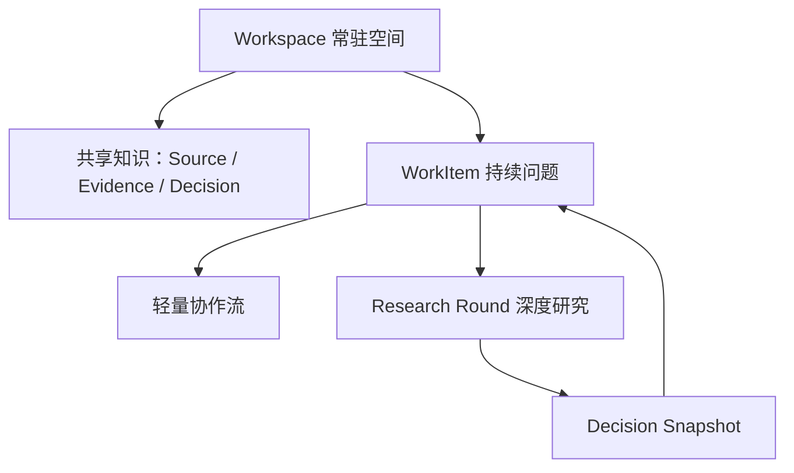
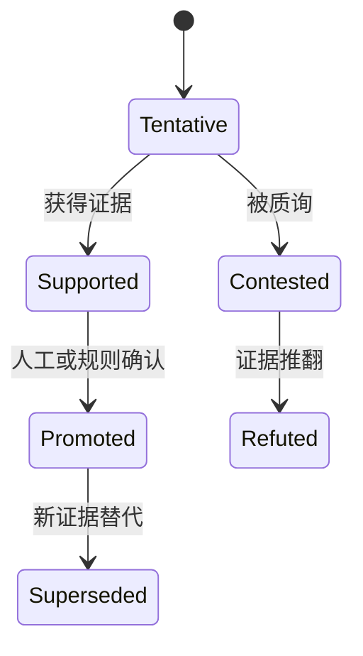

# Counterpoint 体验重构设计 v0.2（修订确认稿）

> 状态：已确认（用户 2026-08-12 审阅通过，进入 PRD 改写与实施计划）
> 日期：2026-08-12
> 取代：本文件 v0.1（“项目 → Deliberation 会议”模型）

## 1. 背景与问题

当前 Web Console 的产品形状是：

```
项目 → 新建 Deliberation（五步向导） → 盲态运行 → 质询/验证/评审 → 人工批准 → 导出 Decision Pack → 结束
```

用户实际体验反馈：**“设计上的体验像是为了解决一个问题临时开个会。”**

根因不是 UI 细节，而是领域模型：**当前产品把“协议执行”误当成了“用户工作的基本单位”**，所以天然像临时开会。

## 2. 核心修正：三个时间尺度

> **`Deliberation ≠ WorkItem`**
> **`Deliberation = WorkItem 下的一次 Research Round`**

如果只给 Deliberation 增加 `kind` 并改名为 WorkItem，一项工作仍然只能经历一次完整协议，会议感只是被藏起来，没有真正消失。



三个不同时间尺度：

- **Workspace**：长期存在，积累项目现实。
- **WorkItem**：持续数小时、数天甚至数周的问题。
- **ResearchRound**：某个时刻冻结上下文，执行一次 Counterpoint 协议。

一个 WorkItem 可以：

- 没有 Research Round，只通过轻量协作解决；
- 发起一次 Research Round；
- 补充新证据后再次发起；
- 引用上一次结果，但不覆盖上一次；
- 多轮结论发生变化时保留完整演进历史。

## 3. 实体映射（修订版）

| 当前实体 | 新模型 |
|---|---|
| Project | Workspace；内部代码可暂时保留 `Project` 名称 |
| 新增 | WorkItem |
| Deliberation | ResearchRound，增加 `workItemId` |
| TaskPacket | ResearchRound 启动时，从 WorkItem 当前上下文生成的冻结快照 |
| Claim / Update | 默认属于 WorkItem 协作流 |
| Round Claim | ResearchRound 内的冻结候选主张 |
| Evidence | 默认保持 Round/WorkItem 作用域 |
| Workspace Knowledge | 被明确提升的 Source、Evidence、Decision 引用 |
| Decision Pack | 一轮 ResearchRound 的不可变快照 |
| Decision Record | WorkItem 当前结论，可引用一轮或多轮 ResearchRound |

**不要把 Task Packet 直接变成 WorkItem 定义。** 两者有本质区别：

- WorkItem 会持续变化；
- Task Packet 必须冻结；
- ResearchRound 必须能证明自己当时看到了哪个版本的 WorkItem。

## 4. D1–D6 修订结论

| 决策 | 结论 | 校正 |
|---|---|---|
| D1 Workspace 第一实体 | 接受 | 全局首页仍可展示 Workspace；进入 Workspace 后首页才是 WorkItem 看板 |
| D2 WorkItem 类型化 | 接受 | `kind` 属于 WorkItem，不属于 Deliberation；类型只改变模板，不要产生五套状态机 |
| D3 协议成为可选操作 | 强烈接受 | 原 Deliberation 应改为或包装成 `ResearchRound` |
| D4 默认轻量协作 | 接受但加门禁 | Claim 不能自动进入共享知识；必须经过验证或人工提升 |
| D5 结果持续沉淀 | 强烈接受 | Research Round 生成不可变快照，WorkItem 保存当前结论及历史演进 |
| D6 协议内核不动 | 强烈接受 | 现有状态机完整保留，只改变它在产品中的层级 |

## 5. 共享知识库与提升门禁

知识积累是这次重构的价值，也是最容易制造下一轮上下文污染的地方。**不能因为一条 Evidence 曾经验证通过，就让所有后续工作项无条件使用。**

工作区级知识至少保存：

```yaml
scope: workspace | module | work_item
subject_refs: []
source_version: ""
status: verified | disputed | superseded | expired
applies_when: ""
not_applicable_when: ""
verified_at: ""
expires_at: ""
provenance:
  work_item_id: ""
  research_round_id: ""
```

正确方式是：

> **Evidence 仍保留在原始工作项/研究轮次中，Workspace Knowledge 保存带适用范围的引用。**

而不是把所有 Evidence 搬到一个全局池里，逐渐变成未经区分的“公共事实”。

Claim 也需要提升机制：



只有 `Promoted` 的内容才能默认进入工作空间知识视图。

## 6. 四个待确认问题的最终答案

### 6.1 是否需要主持人/负责人？

**每个 WorkItem 必须有一名 Human Owner。**

Agent 可以是 Facilitator，负责整理、追问、建议发起 Research Round，但不能成为最终责任主体。单用户版本可以默认当前用户为 Owner，不增加操作负担。

### 6.2 Agent 按需还是常驻？

**v1 只做按需调用，不做常驻观察。**

支持三种入口：

- `@Agent` 定向提问；
- “邀请 Agent 分析”；
- “发起深度研究”。

常驻 Agent 会引入隐性成本、权限扩大、上下文污染和重复评论。未来可以做受约束的 Watcher：

- 只观察特定类型；
- 只响应明确事件；
- 输出摘要或建议；
- 不自动修改结论；
- 不自动发起 Research Round。

### 6.3 工作项关系是否进入 v1？

**进入最小引用能力，不做完整知识图谱。**

v1 至少支持：

- 引用另一个 WorkItem；
- 引用某条 Evidence；
- 引用某个 Decision；
- `related_to`；
- `depends_on`；
- `supersedes`。

界面暂时只展示“关联项”，不用建设复杂图谱页面。

### 6.4 轻量协作是否自动触发 Agent？

**先手动触发，系统可以建议，但不能自动执行。**

例如系统可以提示：

> 当前问题包含三个未验证假设，建议邀请两个独立 Agent 或发起深度研究。

是否真正启动由用户确认，以保留自主性并控制成本与认知污染。

## 7. 分阶段方案（修订）

> 原方案 Phase 1“Deliberation 增加 kind，状态机不改，只改外壳”会固化错误领域模型，已废弃，改为从 Phase 0 开始。

### Phase 0：领域模型分层

- 引入 `WorkItem`；
- 原有 `Deliberation` 增加 `workItemId`，产品语义改为 `ResearchRound`；
- `kind` 加在 WorkItem 上；
- 现有 Deliberation 一对一迁移为：一个 WorkItem + 一个历史 ResearchRound；
- Task Packet 保持冻结语义；
- 原协议状态机完全不改。

### Phase 1：工作空间与导航

- Workspace 详情首页改为 WorkItem 看板；
- 新建入口改为“新建工作项”；
- WorkItem 详情页以问题、当前结论、未知项和证据缺口为中心；
- Research Round 作为页面中的历史区块和操作入口。

### Phase 2：轻量协作流

- 增加 `Claim / Evidence / Question / Update`；
- 支持人类和按需 Agent 追加内容；
- 增加 Claim 状态和知识提升门禁；
- 支持引用工作区已有 Source、Evidence、Decision。

### Phase 3：沉淀与检索

- 决策档案；
- Workspace Knowledge；
- 类型模板；
- 工作项关系；
- 受约束的 Agent Watcher。

## 8. 协议内核保持不变

- 盲态隔离与 Context View；
- Commit–Reveal 与承诺哈希；
- 结构化质询 / 证据请求 / 验证器；
- 匿名 Reviewer 与 Human Gate；
- 事件链、可追溯 Decision Pack、评估体系。

## 9. 最终判断

这不是一次普通的 UI 调整，而是 Counterpoint 从：

> “执行一次可靠的多 Agent 会议”

升级为：

> “承载长期问题解决过程，并在必要时启动可靠认知协议的工作空间”。

核心设计决定正式确定为：

> **Workspace 是长期现实容器，WorkItem 是持续协作单元，ResearchRound 是一次冻结、隔离、验证与裁决过程。**

## 10. 下一步

1. 用户审阅本稿并确认 D1–D6 修订结论；
2. 改写 PRD v0.1 第 8/10/11 节为工作空间模型；
3. 编写实施计划（从 Phase 0 领域模型迁移开始）。
