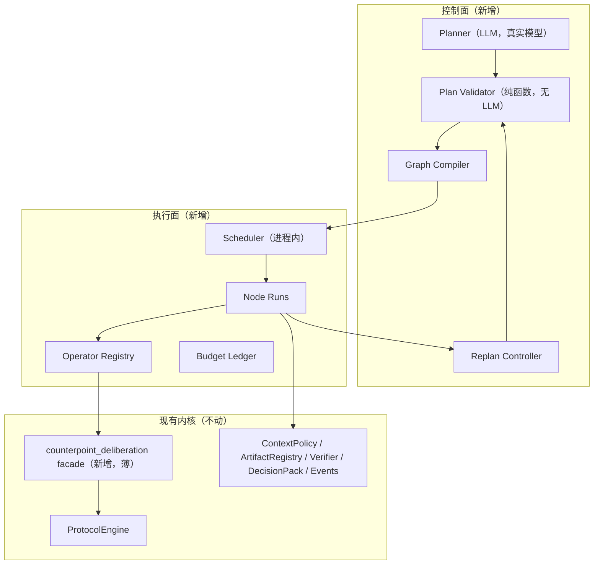

# Counterpoint v0.2 规划与执行面设计（M0–M1）

> 状态：待评审（Draft）
> 日期：2026-08-13
> 上游：[PRD v0.2](C:/Users/tgyzc/Downloads/Counterpoint_复调_PRD_v0.2.md)
> 补充：[2026-08-12-workspace-first-design.md](2026-08-12-workspace-first-design.md)

## 0. 背景与已验证基线

PRD v0.2 的核心变更：把固定 Deliberation 协议从产品主实体降级为
`counterpoint_deliberation` Operator，在其上新增控制面（Planner → Plan Validator →
Graph Compiler）与执行面（Scheduler → Node Runs），并让计划可被证据驱动的 PlanPatch
增量修正。

本仓库基线（2026-08-13 实测，非 README 声明）：

- `npm run typecheck`：通过；
- `npm test`：107/107 通过；
- workspace-first 重构（Workspace / WorkItem / ResearchRound）已落地；
- 真实 Agent 适配器已跑通：Chrys（`C:\Users\tgyzc\project\chrys\.venv\Scripts\chrys.exe`）
  与 Claude Code 2.1.185（`C:\Users\tgyzc\.local\bin\claude.exe`）在本机可用；
- `docs/m1-real-slice/` 记录了首次真实决策闭环，总成本 $1.82，耗时 520s。

本设计只覆盖 M0 与 M1；M2（UI）与 M3（评估）只预留数据接口，不展开界面设计。

## 1. 目标与验收

### 1.1 目标

1. 用纯代码实现并测试「协作宪法」：Schema / DAG / 权限预算 / 上下文边界 / 独立性 /
   证据覆盖六道确定性检查（FR-030~FR-034）。
2. 用真实模型验证核心假设：Chrys 与 Claude Code 能否为不同任务生成
   合法、且拓扑随任务变化的 Collaboration Plan（PRD 15.2 的唯一硬验收）。
3. M1 用真实模型跑通「目标 → 规划 → 验证 → 编译 → 调度 → 改计划 → 决策」闭环，
   且至少发生一次有证据依据的 PlanPatch。

### 1.2 非目标

- Planner 规划 Planner（递归自治）、多租户、常驻 Agent、投票执行；
- 把现有 `ProtocolEngine` 物理重构或重写；
- 在 M1 通过前为 Live Plan 开发新 Web UI。

## 2. 架构分层



模块布局沿用 PRD 14.2：

```text
src/
├── autonomy/        # autonomy-envelope.ts / risk-policy.ts / human-gate.ts
├── planning/        # schemas.ts / planner.ts / plan-validator.ts / plan-patch.ts / stop-condition.ts
├── execution/       # graph-compiler.ts / execution-graph.ts / scheduler.ts / replan-controller.ts / budget-ledger.ts
├── operators/       # agent-task.ts / tool-task.ts / verification.ts / independent-review.ts
│                    # counterpoint-deliberation.ts / human-gate.ts
└── (现有)           # protocol-engine.ts / context-policy.ts / artifact-registry.ts / ...
```

`existing-kernel` 保持物理位置不变，仅作为逻辑定位。

## 3. 数据契约（schemaVersion 0.2.0）

### 3.1 WorkItem 扩展

新增字段（全部可选、带默认值，保证旧数据可解析）：

- `goal: string`、`constraints: string[]`、`expectedOutcomes: string[]`、
  `sourceRefs: string[]`、`autonomyEnvelopeId?: string`；
- 状态机扩展为 PRD 6.2 的 `draft → open → planning → running → waiting_human / blocked
  → resolved / partially_resolved / rejected → archived`。

迁移：现有 `investigating` 映射为 `running`，其余同名状态保留，旧值不出现在新写入中。
沿用 `migrateDatabase` 的幂等一对一迁移模式，`schemaVersion` 升为 `0.2.0`。

### 3.2 新增契约

- `AutonomyEnvelope`：`maxAgents / maxParallelism / maxRounds / tokenBudget? / costBudget? /
  timeBudgetMs / allowedTools / allowedActions / writableScopes / networkPolicy / riskPolicy /
  sharingPolicy`。继承 Workspace 默认值，WorkItem 只能收紧不能放宽（C-02）。
- `CollaborationPlan`：`id / workItemId / version / goal / assumptions / rationale / nodes /
  stopConditions / escalationConditions / budgetAllocation / createdByRunId / status`。
- `CollaborationNode`：`id / role / objective / dependsOn / inputRefs / contextPolicy /
  capabilityRequirements / operator / completionCriteria / failurePolicy / allocatedBudget`。
- `ContextPolicy`（v2）：`readScopes / writeScopes / visibility: shared|private|blind|sealed /
  includeObjectTypes / excludeObjectTypes / revealAfter?`。
- `OperatorSpec`：六种 P0 Operator 的判别联合，其中
  `counterpoint_deliberation` 使用 PRD 10.2 的 `CounterpointDeliberationSpec`。
- `PlanPatch` 与 `PlanOperation`：首批操作 `add_node / cancel_pending_node /
  replace_pending_node / add_dependency / tighten_context_policy / request_additional_budget /
  request_human_gate / change_stop_condition`。
- `StopCondition / EscalationCondition / CompletionCriterion / FailurePolicy / NodeBudget /
  BudgetAllocation`。
- `ExecutionGraph / GraphNode / NodeRun / DecisionRecord`。
- `EvidenceScope`：`sourceVersionRefs / appliesWhen / invalidatedWhen? / expiresAt?`，补进
  现有 `Evidence`。
- `Opinion`：与 `Claim` 分离的独立对象（`statement / rationale / authorRunId`），Decision
  可引用 Opinion，但 Opinion 永远不能自动升级为 Evidence（PR-05）。

WorkItem 现有的 `claim/question/update` 轻量协作流保留为「轻量层」；Run 发布的
`Claim/Evidence/Opinion` 是「宪法治理层」。只有后者能被提升进 Workspace Knowledge。

### 3.3 事件与审计

沿用 append-only Event Chain，新增 `plan.proposed / plan.validation_failed /
plan.validated / graph.compiled / node.ready / run.started / plan_patch.proposed /
plan_patch.applied / human_gate.requested / decision.recorded`。Event Chain 同时作为
Scheduler 的恢复日志（见 §6）。

## 4. 宪法与 Plan Validator

`plan-validator.ts` 是纯函数流水线，任何一步不通过即短路，输出
`accepted / rejected / needs_revision / needs_human_approval` 与机器可读的违规清单：

1. **Schema**：全部 Zod 契约解析 + 引用完整性；
2. **DAG**：Node ID 唯一、依赖存在、无环、存在可达终点（C-01）；
3. **权限与预算**：节点工具/动作 ⊆ Autonomy Envelope；写入范围 ⊆ writableScopes；
   Agent 数、并行度、轮次、时间不超预算；每个节点有预算且重试计入真实预算（C-02/C-03）；
4. **上下文边界**：静态检查每个节点的 `inputRefs / includeObjectTypes / visibility`，
   拒绝 `private/blind/sealed` 对象被未授权节点引用（C-04）；
5. **独立性与风险**：按 Run 血缘而非角色名验证；声称「独立分析」的节点必须绑定
   不同 Adapter 指纹与隔离 Context View；高风险节点必须有独立 Review 或 Human Gate
   （C-05/C-07）；
6. **证据与完成条件**：每个 CompletionCriterion 必须绑定可解析的 Evidence 引用或明确的
   人工验收；未满足 Stop Condition 不能产出 `resolved`（C-06/C-07）。

Planner 的 `rationale` 只用于展示，不参与合法性判断。Validator 不调用任何模型。

## 5. Graph Compiler 与 Operator

`graph-compiler.ts` 把合法 Plan 编译为 `ExecutionGraph`：

- 解析依赖、标记 Ready 节点；
- 按 `capabilityRequirements` 绑定 Adapter（复用现有 mock / local-process / CLI / ACP）；
- 把 `counterpoint_deliberation` 节点绑定到 facade；
- 固化每个节点的 ContextPolicy、预算、失败策略与输入版本引用。

### 5.1 counterpoint_deliberation facade

`src/operators/counterpoint-deliberation.ts` 不复制协议逻辑，只按序驱动现有
`ProtocolEngine` 方法：

`create → freeze → startBlindRun →（等待全部 committed）→ reveal → challenge →
runVerification → freezeEvidence → runReview →（需要时 Human Gate）`

Human Gate 在 facade 中表现为「挂起节点并发出 `human_gate.requested`」，由 Scheduler
等待人类事件后恢复；这是 Scheduler 需要支持的暂停/恢复语义，也是 M1 的关键测试点。

## 6. Scheduler

进程内确定性调度器，替换 `apps/api/jobs.ts` 的内存 JobRegistry：

- 只调度依赖已满足的节点，受 `maxParallelism` 限制；
- 每个 Run 启动前：生成实际 Context View Snapshot（复用 `buildContextView` 的裁剪逻辑，
  输入改为节点 ContextPolicy）、创建隔离/共享工作区、固定输入对象版本、记录 Fingerprint；
- Budget Ledger 全生命周期扣减时间与 Agent 数预算，token/cost 记录但默认不硬闸
  （见 §11 D1）；
- 失败/超时/取消/重试追加历史，不覆盖原 Run；
- 进程重启恢复：重放 Event Chain 重建已提交状态，`running` 的 Run 按重试策略处理；
- 单线程串行化 mutation，避免并发完成时状态互相覆盖；不引入外部队列。

## 7. Replan

- 触发：新 Evidence 推翻假设、节点失败/超时、关键 Evidence 冲突、Completion Criteria
  无法满足、Agent 发现高风险分支、剩余收益低于成本、用户改目标（PRD 9.5）。
- **证据闸门**：`PlanPatch.evidenceRefs` 必须全部解析到真实 Evidence/Artifact 版本，
  否则 patch 直接 `rejected`；这是防 Replan 抖动的机器硬闸。
- 所有 patch 重新过 §4 的同一 Validator；只允许修改未开始节点；已完成的运行历史不可
  删除或覆盖。
- 循环护栏：每个 WorkItem 的 patch 次数与总预算受限；连续 patch 未改善 Stop Condition
  时进入 `waiting_human`。

## 8. Planner Adapter（真实模型）

`src/planning/planner.ts` 通过现有 `CliAgentAdapter` 调用真实模型：

- **Chrys**：`chrys run -a Code --json -t {promptFile} -C {workspace}`，
  `outputMode: 'chrys_json'`；
- **Claude Code**：`claude -p --output-format json --dangerously-skip-permissions
  --model <model>`，`outputMode: 'claude_jsonl'`、`promptViaStdin: true`；
- 二进制路径与模型名走环境变量：`CHRYS_BIN / CLAUDE_BIN / PLANNER_MODEL`，
  默认值沿用 `apps/cli/real-slice.ts`。

Planner 输入：冻结的 WorkItem 版本、Source 摘要、能力目录、Autonomy Envelope、
作用域匹配的 Workspace Evidence。输出必须符合 `CollaborationPlanSchema` 的 JSON；
Prompt 只要求简明 rationale 与 assumptions，不要求、也不持久化隐藏思维链（PR-11）。

修复循环：`needs_revision` 时把 Validator 违规清单回填给 Planner 重试，上限 2 次；
`needs_human_approval` 直接进入 Human Gate。修复循环是 M0 探测的观察对象，不是
MVP 的默认产品行为。

## 9. 测试策略（真实模型为核心）

按「效果验证」与「规则验证」分层，二者不可互相替代：

### L0：宪法合成用例（离线，进 CI）

`tests/unit/plan-validator.test.ts` 与 `tests/unit/graph-compiler.test.ts`：手工构造
合法计划与每类违规计划（环、悬空依赖、越权、超预算、上下文泄漏、自我评审、证据缺失），
断言 Validator/Compiler 的确定性行为。这一层测的是规则代码本身，真实模型无法按要求
稳定产出非法计划，因此用合成用例，不用真实 Agent。

### L1：真实 Planner 探测（M0 的「效果」证据）

新增 `apps/cli/planner-probe.ts`，**只使用真实 Chrys 与 Claude Code**：

- 2 个固定 Fixture：一个简单工程问题（期望 1 Agent + 1 Verifier），一个复杂 Bug
  （期望多节点、并行假设、验证、Review）；可选第 3 个技术决策（期望触发
  `counterpoint_deliberation` 拓扑）；
- 每个 Fixture 由两个真实 Planner 各生成一次（修复循环上限 2 次），产出经真实
  Validator 判定；
- 指标：首次通过率、修复后通过率、拒绝原因分布、拓扑签名（节点数/并行度/Operator
  组合）、跨 Fixture 拓扑差异、单计划成本与耗时、Prompt 长度；
- 预算护栏：探测总预算 $6 上限，单次 Planner 调用超时 10 分钟，超限即终止并报告；
  Chrys 不报账单，沿用 `chrysCostRates` 按实测 token 估算；
- 验收：两个 Planner 在修复后各产出至少一份合法计划，且简单/复杂两个 Fixture 的
  拓扑签名不同（PRD 15.2）。首次通过率不设硬门槛，只记录并在评审时讨论。

### L2：M1 真实垂直切片

复用 `real-slice.ts` 的真实 Agent 接线：Chrys + Claude Code Worker、Claude Code
Reviewer，由 Scheduler 而非手工驱动；必须发生至少一次证据依据的 PlanPatch；用真实
`npm run typecheck` / `npm test` 作为 Verification 证据；输出完整 Plan 演化记录。

### L3：M3 评估（本设计范围外）

A/B/C/D 对照跑 15–30 个真实历史任务，指标见 PRD 16.3。

### Mock 的剩余位置

Mock Adapter 仅保留用于 CI 的引擎/适配器离线回归（真实 CLI 无法进 CI），不参与任何
「效果」判断；所有效果结论必须来自 L1/L2 的真实模型运行。

## 10. 里程碑与 DoD

### M0：Planning Contract

交付：§3 全部 Schema 与迁移；Mock Planner（仅用于类型与编译测试）；Plan Validator；
Graph Compiler；合法/非法计划测试集（L0）；`planner-probe.ts` 与首次真实探测报告（L1）。

DoD：

- [ ] 六类宪法违规全部有对应拒绝用例；
- [ ] 合法计划可编译为可调度 DAG；
- [ ] Chrys 与 Claude Code 各产出至少一份合法计划；
- [ ] 简单/复杂 Fixture 拓扑签名不同；
- [ ] 探测成本、耗时、拒绝原因被记录并可复核。

### M1：Autonomous Vertical Slice

交付：Scheduler、Budget Ledger、六个 P0 Operator、counterpoint_deliberation facade、
Replan Controller、CLI 复杂 Bug 闭环 Demo（真实模型）。

DoD：

- [ ] 目标 → 规划 → 验证 → 编译 → 调度 → 改计划 → 决策全自动闭环；
- [ ] 至少一次 Evidence-grounded PlanPatch 被验证并增量生效；
- [ ] 每个 Run 有实际 Context View Snapshot，泄漏计数 = 0；
- [ ] Reviewer 独立性按 Run 血缘验证；
- [ ] 进程重启后可从事件链恢复；
- [ ] Decision Pack 引用解析到固定版本（unresolvedRefs = 0）。

## 11. 待确认决策（附建议默认值）

| 决策 | 建议默认值 | 影响 |
|---|---|---|
| D1 预算单位 | 时间 + Agent 数 + 并行度 + 轮次确定性硬闸；token/cost 只记录不硬闸 | 简单、可测试；token/cost 硬闸留到 M2+ |
| D2 PlanPatch 证据门 | 证据引用必须解析；至少一条 verified Evidence 或明确人工批准 | 防抖动；太松会让模型随意改计划 |
| D3 现有向导 UI | 冻结，不删；M2 时作为 `counterpoint_deliberation` 的配置入口 | 避免错误信息架构继续固化 |
| D4 Planner 修复轮次 | 上限 2 次 | 控制成本，观察真实修复率 |
| D5 L1 Fixture 数量 | 2 个必做 + 1 个可选决策 Fixture | 2 个已满足 PRD 15.2 最小差异验收 |

## 12. 风险与缓解

| 风险 | 缓解 |
|---|---|
| Planner 产出漂亮但不可执行 | 强 Schema + 修复循环 + 真实 Validator 判定（L1 直接测量） |
| 单 Planner 认知单点 | M0 只验证单 Planner；后续 Plan Critic 由 Validator 强制规则替代 |
| Replan 抖动 | 证据闸门 + 次数/预算上限 + 连续无改善即 Human Gate |
| 角色名伪装独立性 | Run 血缘 + Context View Snapshot + Adapter Fingerprint 验证 |
| 真实模型成本失控 | 探测预算硬上限 $6、单次超时、失败即停 |
| 67KB ProtocolEngine 继续膨胀 | facade 薄壳化；新逻辑一律不进内核 |
| 单文件 JSON 存储并发写 | 进程内串行化 mutation + 事件链恢复；多用户前换存储 |
| UI 又把协议表当主界面 | M2 前冻结向导；Live Plan 以 Goal/Unknowns/Needs Attention 为中心 |
